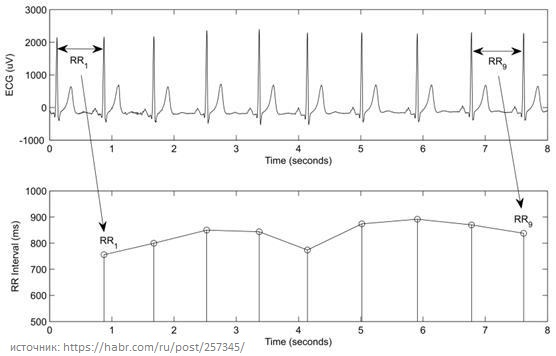

# CardioSpike
Решение задачи обнаружения ковидных аномалий в ритмограммах сердца  

# Описание репозитория
`analysis` содержит разведочный анализ данных и первую разработку признаков  
`baseline` содерижт первоначальную разработку модели и подбор её гиперпараметров  
`hypothesis` содержит ноутбуки с проработанными гипотезами  
`img` содержит изображения, необходимые для данного README.md  
`input` содержит данные для обучения и теста  
`pipelines` содержит ноутбуки с различными версиями решения. Итоговое решение в ноутбуке _cardiospike-isd-pipeline-10_ 

# Описание задачи
Имеется набор данных о ритме сердца в виде одной или нескольких ритмограмм. Необходимо напротив каждой точки измерения проставить признак ковидной аномалии: 0 - аномалии нет, 1 - есть.  

|  id |  time |   x |   y |
|----:|------:|----:|----:|
|  81 |     0 | 576 |   ? |
|  81 |   568 | 568 |   ? |
|  81 |  1140 | 572 |   ? |
| ... | ...   | ... | ... |
| 176 | 44332 | 568 |   ? |
| 176 | 44968 | 636 |   ? |
| 176 | 45596 | 628 |   ? |

`id` - идентификатор/номер ритмограммы  
`time` - время в миллисекундах  
`x` - значение интервала между сердцебиениями (R-R интервал)  
`y` - признак ниличия ковидной аномалии

  
На верхнем графике электро-кардиограмма, на нижнем - ритмограмма.